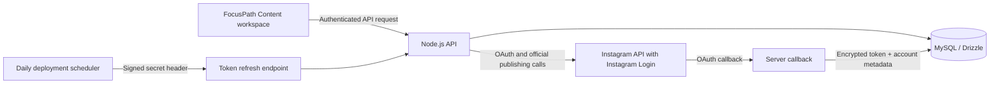

# FocusPath Instagram Content Agent — Phase 1 Implementation Guide

**Status:** Implemented in this repository on 13 August 2026. This delivery completes the specification’s first phase: a secure connection flow and **manual publishing workspace** for one owner-managed Instagram professional account. It intentionally does **not** generate, schedule, or autonomously publish content. Every publish operation still requires an explicit action in FocusPath.

## What Is Included

The implementation adds a dark, responsive **Content** workspace to FocusPath. An authenticated user can connect a single professional Instagram account using Meta OAuth, save image, Reel, Story, or carousel drafts, and publish manually using Instagram’s official container workflow. Drafts, publish state, error messages, and immutable publish-event records are stored in the application database.

| Area | Delivered behavior | Boundary in this release |
| --- | --- | --- |
| Account connection | Server-side OAuth authorization-code exchange, long-lived token exchange, encrypted local storage, reconnect, and local disconnect | The account owner must complete Meta’s one-time developer setup before connecting. |
| Manual composer | Image, Reel, Story, and carousel drafts with caption, alternate text, and AI-media disclosure flag | Media is supplied as a **public HTTPS URL**; in-app upload and media generation are not part of Phase 1. |
| Publishing | Official `media` container creation, readiness check, quota check, and `media_publish` call | Video processing may require the user to select **Check & publish** later; the app does not poll aggressively. |
| Recovery | Failed posts remain as drafts, retain the provider-safe error text, and may be retried through the normal publish action | Failed uploads are not silently retried. |
| Token lifecycle | Daily-ready, secret-protected refresh endpoint; refreshes connections within 14 days of expiry and only after the 24-hour minimum age | The deployment administrator must create the once-daily scheduled invocation described below. |
| Security | AES-256-GCM encryption at rest; signed, 10-minute OAuth state; credentials are never returned from the API or logged | The encryption and scheduler secrets must be provisioned in the hosting environment. |

> **Operational principle:** Phase 1 is manual by design. Saving a draft never sends it to Instagram, and publishing begins only when the user selects the publish control on a specific draft.

## Architecture

The implementation aligns with the existing FocusPath Expo and Node.js codebase rather than replacing it with a separate application. The client talks to the server through authenticated, typed API calls. Meta credentials, long-lived access tokens, and encryption keys remain exclusively on the server.



| Repository location | Responsibility |
| --- | --- |
| `app/(tabs)/content.tsx` | Content workspace: connection status, manual composer, draft queue, publish/retry/delete controls. |
| `app/oauth/instagram.tsx` | Deep-link return screen after Meta authorization. |
| `server/instagramRouter.ts` | Authenticated client API. It exposes connection status and draft actions without exposing access tokens. |
| `server/_core/instagramOAuth.ts` | Express callback that validates OAuth state, exchanges tokens, obtains profile metadata, and saves an encrypted connection. |
| `server/_core/instagramClient.ts` | Official Meta endpoint client for authorization exchange, refresh, containers, readiness, quota usage, and publication. |
| `server/_core/instagramSecurity.ts` | AES-256-GCM credential encryption and HMAC-signed OAuth state. |
| `server/instagramService.ts` | Ownership checks, draft persistence, non-aggressive publish flow, audit trail, disconnect, and refresh orchestration. |
| `server/_core/instagramScheduler.ts` | Secret-protected endpoint used by the once-daily refresh trigger. |
| `drizzle/0001_instagram_content_agent.sql` | Migration for connection, draft, and publish-event tables. |

## Meta One-Time Setup

Before using the workspace, make the account a Business or Creator account and configure a Meta app with the **Instagram API with Instagram Login** product. For an app used only with professional accounts the owner manages and has added to the app, Meta documents **Standard Access** as the applicable access level; serving unrelated accounts requires Advanced Access.[1]

In the Meta dashboard, configure the exact callback URL set in `INSTAGRAM_REDIRECT_URI`, including any trailing slash behavior. The authorization URL, callback URL, and server-side code exchange use the `instagram_business_basic` and `instagram_business_content_publish` scopes. Authorization codes are single-use and valid for one hour.[1]

| Required dashboard value | FocusPath configuration |
| --- | --- |
| Instagram App ID | `INSTAGRAM_APP_ID` |
| Instagram App Secret | `INSTAGRAM_APP_SECRET` |
| Valid OAuth redirect URI | `INSTAGRAM_REDIRECT_URI` — for example, `https://api.example.com/auth/instagram/callback` |
| Business Login permissions | `instagram_business_basic`, `instagram_business_content_publish` |
| Native return target | `EXPO_PUBLIC_APP_URL=manusfocuspath://` for the current mobile build; set your HTTPS app URL for a web deployment |

Meta’s current workflow exchanges the authorization code for a short-lived Instagram user token, then exchanges that token server-side for a 60-day long-lived token.[1] The server implementation follows that separation and never exposes the app secret or long-lived token to the Expo client.

## Local Setup

Copy the safe template, enter real values only in the untracked `.env`, install the migration, and start the existing application stack.

```bash
cd /path/to/my-focus-path-
cp .env.example .env
# Edit .env with real server-side secrets; do not commit it.
pnpm install --frozen-lockfile
pnpm db:push
pnpm dev
```

Generate the encryption and scheduler values with strong random data. The encryption key is deliberately stable: changing it makes previously encrypted token records unreadable, which requires affected users to reconnect.

```bash
openssl rand -base64 32   # INSTAGRAM_TOKEN_ENCRYPTION_KEY
openssl rand -hex 32      # INSTAGRAM_SCHEDULER_SECRET
```

## Publishing Behavior and Limits

Instagram publishing uses a two-step container model: FocusPath creates a container at `/{ig-user-id}/media`, checks its readiness, and publishes it through `/{ig-user-id}/media_publish`.[2] Instagram fetches the media from the supplied URL, so the media must be publicly reachable when publication is attempted.[2]

The current official documentation states that accounts are limited to **100 API-published posts in a moving 24-hour period**, and it provides `content_publishing_limit` so applications can inspect usage.[2] FocusPath checks this endpoint before making a publish call, but it also preserves any final Meta rejection as a failed draft for human review. A carousel must contain between two and ten public media URLs; it counts as one post for quota purposes.[2]

Video containers can remain in `IN_PROGRESS`. The implementation performs one readiness check per explicit user action rather than continuous polling. When Instagram has not finished processing, the user sees **Check & publish** and can try again after about a minute. This follows Meta’s recommendation to poll a processing container at most once per minute and for no more than five minutes.[2]

| Draft status | Meaning | User action |
| --- | --- | --- |
| `DRAFT` | Stored only in FocusPath; no container exists. | Edit or select **Publish**. |
| `CREATING_CONTAINER` | A publish request is creating the Meta container. | Wait for the request to finish. |
| `AWAITING_MEDIA` | Container exists but the media is still processing. | Select **Check & publish** later. |
| `PUBLISHING` | The final Meta publish request is in progress. | Wait; do not duplicate the action. |
| `PUBLISHED` | Meta returned a media ID. | Review the published post on Instagram. |
| `FAILED` | A recoverable or validation error occurred. The draft remains saved. | Correct the draft or retry deliberately. |

## Daily Token Refresh

A long-lived Instagram user token may be refreshed only after it is at least 24 hours old and before it expires; a successful refresh grants another 60 days.[3] Configure the deployment platform to make one authenticated `POST` request each day to:

```text
https://YOUR-API-HOST/api/scheduled/instagram-token-refresh
```

The request must include the following header. The endpoint returns aggregate counts only and deliberately does not disclose account identifiers or token information.

```text
x-instagram-scheduler-secret: YOUR_INSTAGRAM_SCHEDULER_SECRET
```

| Approach | Tradeoffs | Cost | Setup complexity |
| --- | --- | --- | --- |
| Managed application scheduler, once per day | Recommended for a deployed FocusPath service. It runs independently of a developer’s computer and calls the protected refresh endpoint. | Usually included or low usage-based cost with the chosen host. | Moderate: add one secret and one daily HTTP schedule. |
| External scheduler service, once per day | Works when the current host lacks scheduled jobs. The external service must store the callback URL and header secret safely. | Often free at low volume, depending on provider. | Moderate: configure a secure request and alerting. |
| Manual refresh through reconnection | No scheduler configuration, but the owner must reconnect before expiry and may lose publishing availability if this is missed. | No ongoing automation cost. | Low, but operationally fragile. |

Do **not** use a frequent polling task. The job is designed for a single daily refresh pass, uses a 14-day pre-expiry window, and skips credentials refreshed or connected less than 24 hours ago.

## Security and Compliance Controls

The implementation uses OAuth only. It does not request, store, or transmit an Instagram password. Long-lived access tokens are encrypted using AES-256-GCM before database storage, and decryption occurs only in the server process immediately before an official Meta API call. OAuth state contains a user ID, expiration, and nonce, then receives an HMAC-SHA-256 signature; it expires after ten minutes.

Disconnecting an account wipes the locally stored encrypted credential immediately while preserving draft and audit data. The integration does not scrape Instagram, use unofficial automation, simulate engagement, bulk like/follow/comment, or publish without a deliberate user action.

## Verification Performed

The project was installed using its lockfile and the following checks passed after implementation:

```text
pnpm check
pnpm test
```

The test suite includes regression coverage that verifies encrypted tokens do not contain their plaintext and that a signed OAuth state is accepted while a tampered state is rejected.

## Next Delivery Phases

The current database model reserves space for later improvements without activating them early. Build the next phases only after a Meta sandbox or live-account publishing test succeeds.

| Phase | Planned increment |
| --- | --- |
| Phase 2 | Brand Brain settings, external research ingestion, structured content generation, quality score, approval workflow, and generation history. Approval remains the default. |
| Phase 3 | Weekly calendar, schedule execution with quotas and recovery, Insights ingestion, 7/30/90-day reporting, and daily performance report. |
| Phase 4 | Explainable learning loop using shares, saves, comments, retention, reach, and follower growth; opt-in autonomous mode with a clear warning and stop controls. |

## References

[1]: https://developers.facebook.com/documentation/instagram-platform/instagram-api-with-instagram-login/business-login "Meta for Developers — Business Login for Instagram"
[2]: https://developers.facebook.com/documentation/instagram-platform/content-publishing "Meta for Developers — Instagram Content Publishing"
[3]: https://developers.facebook.com/documentation/instagram-platform/reference/refresh_access_token "Meta for Developers — Refresh Access Token"
